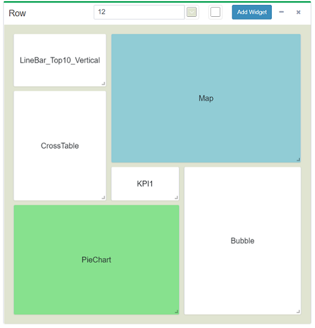

# CBoard-v

CBoard-v 是个人项目，目的是使用 Vue 2.0 重写 CBoard 的前端部分。

CBoard 是一个他人开源的 BI 工具，用于生成可视化报表。[（项目原地址）](https://github.com/TuiQiao/CBoard)  

因为 CBoard 的前端是由 AngularJs（1.4.x）构建的，考虑到目前的前端生态，为了方便以后的二次开发和维护，因此决定用 Vue 重写。

### [在线演示](http://www.hcbook.cc/cboard/)
账号：admin  
密码：root123

## 技术栈
Vue + Vue Router + Vuex + Element-UI

## 新的特性
根据业务的需要，新增了一些特性；  
如可以定制更复杂的布局、调整背景色：  

## 进度
由于时间有限，仅完成部分功能。后续持续完善中...